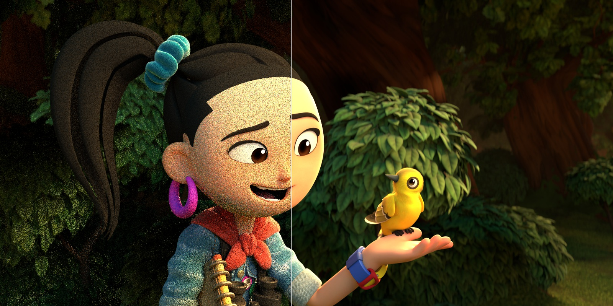
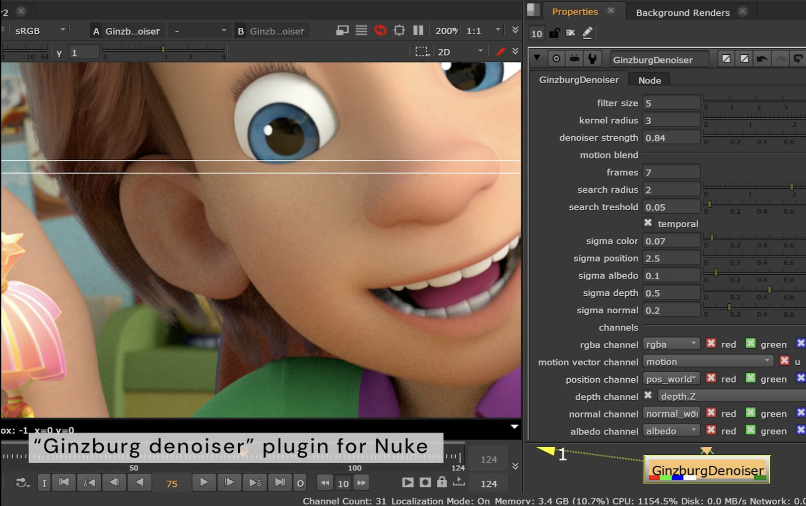
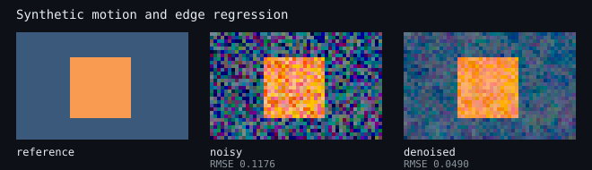

# AOV-Guided Temporal Denoiser for Nuke

[](https://github.com/ginzburg-dev/nuke-aov-temporal-denoiser/actions/workflows/ci.yml)
[](https://github.com/ginzburg-dev/nuke-aov-temporal-denoiser/releases/latest)
[](LICENSE)

Experimental C++ denoiser for Monte Carlo renders. The filter combines
motion-compensated samples from adjacent frames with a spatial cross-bilateral
filter guided by renderer AOVs.



Left: noisy input. Right: denoised output. Scene:
[Blender 3.0 – Sprite Fright](https://cloud.blender.org/p/gallery/617933e9b7b35ce1e1c01066)
by [Blender Studio](https://studio.blender.org/), CC BY.

## Filter

The Nuke node reads the current frame and up to three frames on either side.
For each output pixel it:

1. Traces the selected motion channels to a neighboring frame.
2. Searches around the predicted position.
3. Rejects candidates that disagree in beauty, albedo, or world position.
4. Weights the remaining temporal sample by guide distance, search distance,
    and frame age.
5. Applies a spatial filter using beauty, albedo, normal, depth, position, and
    pixel distance.
6. Uses the resulting weights for beauty and four optional RGB passes.

The guide math and matching code have no Nuke dependency. The adapter in
[`src/nuke`](src/nuke) handles temporal contexts, channel selection, tile
requests, and scanline output.

The exact weight equations are in [docs/ALGORITHM.md](docs/ALGORITHM.md).

## Nuke integration



## Core build

Requires CMake 3.20 and a C++17 compiler.

```bash
cmake -S . -B build -DNTD_WARNINGS_AS_ERRORS=ON
cmake --build build --parallel
ctest --test-dir build --output-on-failure
```

To rebuild the regression image:

```bash
./build/ntd_synthetic_demo docs/synthetic-demo.svg
```

The tests cover parameter bounds, spatial weights, temporal rejection,
correspondence search, AOV normalization, and the synthetic RMSE check.



The regression scene contains a moving surface with a hard depth and normal
discontinuity. With the default test settings, the filter reduces RMSE from
`0.1176` to `0.0490`.

## Nuke build

The Nuke SDK is not included. Set `NUKE_SDK_ROOT` to the Nuke application
directory containing `cmake/NukeConfig.cmake` and `include/DDImage`:

```bash
cmake -S . -B build \
    -DNTD_BUILD_NUKE_PLUGIN=ON \
    -DNUKE_SDK_ROOT=/path/to/nuke
cmake --build build --target GinzburgTemporalDenoiser --parallel
```

Copy the resulting module to a directory on Nuke's plug-in path. The host and
plug-in must use compatible compiler, standard library, architecture, and Nuke
versions.

The temporal input setup uses the NDK
[`split_input` / `inputContext` API](https://learn.foundry.com/nuke/developers/latest/ndkreference/Plugins/classDD_1_1Image_1_1Op.html).

## Releases

Changing the project version in `CMakeLists.txt` and merging it into `main`
tests the core, creates the matching `v*` tag, and publishes a source release.
GitHub attaches the standard source archives automatically. Prebuilt Nuke
modules are not included because they must match the target Nuke version,
compiler, standard library, and architecture.

Local plug-in build and packaging commands are documented in
[docs/RELEASING.md](docs/RELEASING.md).

## Channels

| Knob | Components | Use |
|---|---:|---|
| Beauty | RGB | Filtered signal and color guide |
| Motion | XY | Forward motion in pixels |
| Albedo | RGB | Material boundary guide |
| Normal | RGB | Surface orientation guide |
| Position | RGB | Correspondence and disocclusion rejection |
| Depth | 1 | Depth boundary guide |
| Extra 0–3 | RGB | Optional passes filtered with the beauty weights |

`motion scale` converts the incoming vector convention to pixel displacement.
`maximum motion / frame` controls both motion clamping and tile padding.

## Layout

```text
include/ntd/              Filter math and data types
src/                      Core implementation
src/nuke/                 Nuke Iop adapter
tests/                    Core tests
examples/SyntheticDemo.cpp
docs/ALGORITHM.md         Filter equations and implementation notes
```

The public CI builds and tests the core with GCC and Clang. Tagged releases
publish the tested source revision.

## License

The source code is Apache-2.0. Visual assets are not covered by the code
license: the Sprite Fright comparison is credited above and remains available
under CC BY; the Nuke screenshot is reproduced from the earlier Ginzburg
Denoiser project for historical context.
